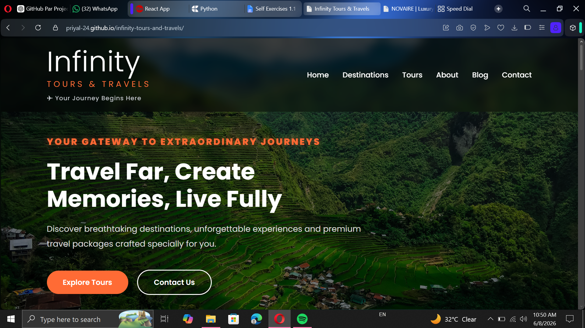

<div align="center">

# ✈️ Infinity Tours & Travels

### Your Journey Begins Here

A premium and modern travel agency website designed to inspire travelers, showcase breathtaking destinations, and deliver unforgettable travel experiences.



</div>

---

## 🌍 Live Demo

🔗 https://priyal-24.github.io/infinity-tours-and-travels/

---

# 📖 About The Project

Infinity Tours & Travels is a modern and fully responsive travel agency website built using HTML5 and CSS3.

The website is designed to provide travelers with an immersive experience through stunning visuals, premium layouts, and well-structured content. It highlights travel destinations, tour packages, services, customer testimonials, and travel stories while maintaining a clean and professional user interface.

This project demonstrates front-end development skills, responsive design techniques, and modern UI/UX principles.

---

# ✨ Features

### 🏠 Hero Section
- Full-screen immersive background
- Strong call-to-action buttons
- Premium travel branding

### 🧭 Navigation
- Sticky navigation bar
- Smooth user experience
- Clean and modern layout

### 🌴 Destinations
- Popular travel destinations
- Interactive destination cards
- Modern hover effects

### ✈️ Tour Packages
- Featured travel packages
- Professional card design
- Easy-to-read package details

### 🏨 Services
- Travel planning
- Adventure experiences
- Luxury accommodations
- Private travel guides

### ⭐ Testimonials
- Customer reviews
- Trust-building section

### 📰 Travel Blog
- Travel stories and inspiration
- Clean blog card layout

### 📱 Responsive Design
- Mobile Friendly
- Tablet Friendly
- Desktop Optimized

---

# 🛠️ Technologies Used

| Technology | Purpose |
|------------|----------|
| HTML5 | Structure |
| CSS3 | Styling |
| Font Awesome | Icons |
| Google Fonts | Typography |
| GitHub Pages | Deployment |

---

# 📂 Project Structure

```text
Infinity-Tours-And-Travels/
│
├── images/
│
├── index.html
├── style.css
├── Screenshot.png
└── README.md
```

---

# 🎯 Key Highlights

✔ Modern Travel Agency Design

✔ Fully Responsive Layout

✔ Clean User Interface

✔ Professional Branding

✔ Interactive Hover Effects

✔ Optimized Visual Hierarchy

✔ Portfolio Ready Project

---

# 🚀 Future Improvements

- Online Tour Booking System
- Contact Form Integration
- Travel Search Functionality
- User Authentication
- Dynamic Tour Management
- Backend Integration
- Payment Gateway Support

---

# 💡 What I Learned

During this project, I improved my understanding of:

- Semantic HTML
- CSS Flexbox
- CSS Grid
- Responsive Design
- UI/UX Design Principles
- Layout Planning
- GitHub Deployment

---

# 👩‍💻 Developer

## Priyal Patel

Aspiring Front-End & Django Developer passionate about creating modern, responsive, and user-friendly web experiences.

### GitHub

https://github.com/priyal-24

---

# ⭐ Support

If you like this project, consider giving it a star on GitHub.

---

<div align="center">

### "Travel Far, Create Memories, Live Fully."

🌍 ✈️ 🌴

</div>

---

© 2026 Infinity Tours & Travels. All Rights Reserved.